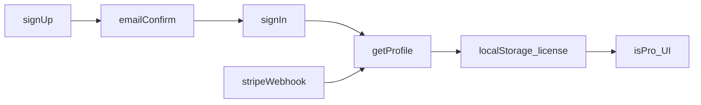

# Finalyze - Enhancement backlog

A prioritized review of the **Finalyze** codebase: static SPA (`app/`, `js/`), landing (`index.html`), client-side data (IndexedDB via `js/store.js`), and backend touchpoints (Supabase Auth/PostgREST, Stripe webhook). Financial transactions intentionally stay on-device; server stores account metadata and license only.

**Last reviewed:** May 2026

---

## Legend

| Priority | Meaning |
|----------|---------|
| **Critical** | Security, billing correctness, or trust-breaking UX - fix before scaling users |
| **High** | Major friction, accessibility blockers, or revenue/referral impact |
| **Medium** | Meaningful polish, consistency, or maintainability |
| **Low** | Nice-to-have; defer until higher tiers are addressed |

**Effort:** S = small (hours), M = days, L = multi-day / architectural

---

## Table of contents

- [Architecture note](#architecture-note)
- [UI / UX](#ui--ux)
  - [Critical](#ui-critical)
  - [High](#ui-high)
  - [Medium](#ui-medium)
  - [Low](#ui-low)
- [Backend & platform](#backend--platform)
  - [Critical](#backend-critical)
  - [High](#backend-high)
  - [Medium](#backend-medium)
  - [Low](#backend-low)
- [Product & marketing alignment](#product--marketing-alignment)
- [Data & performance](#data--performance)
- [Quick wins](#quick-wins)
- [Out of scope](#out-of-scope)

---

## Architecture note

**Pro license** gates UI features (history window, AI, rules). It is **not** a security boundary for local data - anyone can edit `localStorage`. Treat Pro as entitlement/honor system unless you add server-verified APIs (which would conflict with the privacy model for transactions).

---

# UI / UX

## Critical

---

### Account messaging contradicts product behavior

**Priority:** `CRITICAL` · **Effort:** S

**Why:** Landing privacy says account is optional; FAQ says a free account is required; when Supabase is configured the app blocks import until sign-in (`requiresSignIn()`). Users lose trust when marketing and product disagree.

**Where:** [index.html](../index.html), [js/app.js](../js/app.js)

**Suggestion:** Pick one story: (A) optional local-only when auth is off, (B) account required when auth is on - and align hero, FAQ, privacy, and empty-state copy. If (B), remove “optional” from privacy spotlight.

---

### Free-tier insights use full transaction history

**Priority:** `CRITICAL` · **Effort:** M

**Why:** Dashboard filters to 2 months for free users, but Insights/chat stats can use all stored transactions via `enriched()` - undermines the Pro value prop and feels unfair.

**Where:** [js/app.js](../js/app.js) (`FREE_MONTHS`, `isFreeGated`), [js/chat.js](../js/chat.js) (`localInsights`)

**Suggestion:** Pass the same date cutoff (or filtered txn list) into insight generation when `isFreeGated()` is true; show a Pro upsell if they have older data in IDB.

---

### Onboarding save failures are silent

**Priority:** `CRITICAL` · **Effort:** S

**Why:** Profile save errors are swallowed (`catch (e) {}`), modal still closes - user thinks onboarding succeeded; country/currency/goals may be missing server-side.

**Where:** [js/account.js](../js/account.js) (`wireOnboard`)

**Suggestion:** Surface error in `#acctMsg` (or inline), keep modal open, disable “Continue” until save succeeds.

---

### Import has no reliable in-progress or error UI

**Priority:** `CRITICAL` · **Effort:** M

**Why:** Import modal closes before async parse/merge; failures appear in a toast that auto-dismisses in ~3.6s - easy to miss for multi-file or PDF imports.

**Where:** [js/app.js](../js/app.js) (`doImport`, `handleFiles`, `toast`)

**Suggestion:** Global import overlay with spinner, per-file status, sticky error panel; keep toast for success only.

---

## High

---

### Modal accessibility (focus, labels, escape)

**Priority:** `HIGH` · **Effort:** M

**Why:** Three modal systems lack focus trap, `aria-labelledby`, and focus restore on close - keyboard and screen-reader users get lost.

**Where:** [js/app.js](../js/app.js) (`#modal`), [js/account.js](../js/account.js) (`.acct-modal`), [js/aiui.js](../js/aiui.js) (`.ai-modal`), [app/index.html](../app/index.html)

**Suggestion:** Shared modal helper: trap focus, label from `<h2>`, restore trigger focus, consistent Escape handling.

---

### Toast notifications not announced

**Priority:** `HIGH` · **Effort:** S

**Why:** `#toast` updates text without `aria-live` - blind users miss import failures and auth errors.

**Where:** [app/index.html](../app/index.html), [js/app.js](../js/app.js)

**Suggestion:** `role="status"` + `aria-live="polite"` (or `assertive` for errors); optional separate error toast that does not auto-dismiss.

---

### Sign-in / sign-up forms lack real labels

**Priority:** `HIGH` · **Effort:** S

**Why:** Email and password use placeholders only - fails WCAG; placeholders disappear when typing.

**Where:** [js/account.js](../js/account.js) (`openSignIn`)

**Suggestion:** Visible `<label for="...">` or `aria-label`; link fields to `#acctMsg` with `aria-describedby` on validation errors.

---

### Onboarding cannot be skipped or dismissed

**Priority:** `HIGH` · **Effort:** S

**Why:** First sign-in forces multi-step wizard with no close - blocks dashboard and first import; stacks with sign-in and demo tour modals.

**Where:** [js/account.js](../js/account.js) (`openOnboarding`)

**Suggestion:** “Skip for now” (sets minimal defaults), persist `onboarded` locally with option to finish later from account panel.

---

### Email confirmation modal - no resend or mail affordance

**Priority:** `HIGH` · **Effort:** M

**Why:** Dedicated post-signup modal is good; users still need “Resend email” and optional `mailto:` / copy-address when mail is slow.

**Where:** [js/account.js](../js/account.js) (`openConfirmEmailSent`)

**Suggestion:** Add resend via Supabase Auth API (if exposed) or support link; show which email address was used.

---

### Charts and heatmap are not accessible

**Priority:** `HIGH` · **Effort:** M

**Why:** Category, merchant, trend widgets are canvas-only; heatmap cells are empty buttons with `title` only - no keyboard path to data.

**Where:** [js/app.js](../js/app.js), [js/charts.js](../js/charts.js)

**Suggestion:** Collapsible data table under each chart; `aria-label` on heatmap cells (date + amount); document “data table” toggle in widget chrome.

---

### Landing vs app visual inconsistency

**Priority:** `HIGH` · **Effort:** M

**Why:** Different accent colors, button padding/radius, theme defaults - feels like two products after sign-in.

**Where:** [landing.css](../landing.css), [styles.css](../styles.css), [index.html](../index.html), [app/index.html](../app/index.html)

**Suggestion:** Shared CSS variables file or aligned tokens (`--accent`, `--radius`, `--btn-pad`); one theme toggle pattern.

---

### Mobile: bulk transaction actions removed

**Priority:** `HIGH` · **Effort:** M

**Why:** `.bulk-bar` hidden on mobile with no alternative - power users cannot tag/categorize in bulk on phone.

**Where:** [styles.css](../styles.css), [js/app.js](../js/app.js)

**Suggestion:** Row action menu per card layout, or bottom sheet “Select multiple” mode.

---

### Multiple competing `<h1>` on app page

**Priority:** `HIGH` · **Effort:** S

**Why:** Page title and empty/auth states each expose `<h1>` - broken heading outline for assistive tech.

**Where:** [app/index.html](../app/index.html)

**Suggestion:** Single `<h1>` in shell; empty states use `<h2>`.

---

### Destructive actions use native `confirm()`

**Priority:** `HIGH` · **Effort:** S

**Why:** Clear-all / clear-transactions use browser `confirm()` - inconsistent, poor a11y, ugly on mobile.

**Where:** [js/app.js](../js/app.js)

**Suggestion:** Reuse app modal pattern with clear consequence copy and primary/secondary buttons.

---

## Medium

---

### Skip link missing on landing and app

**Priority:** `MEDIUM` · **Effort:** S

**Where:** [index.html](../index.html), [app/index.html](../app/index.html) - [docs/index.html](index.html) already has one

**Suggestion:** “Skip to main content” link matching docs pattern.

---

### No boot loading state

**Priority:** `MEDIUM` · **Effort:** S

**Where:** [js/app.js](../js/app.js) (`init`, `Store.init`)

**Suggestion:** Lightweight skeleton or spinner on `#dashboard` until first `render()` completes.

---

### Filtered dashboard empty state

**Priority:** `MEDIUM` · **Effort:** S

**Where:** [js/app.js](../js/app.js) (`render`)

**Suggestion:** When filters yield zero rows, show “No transactions match” + “Clear filters” button.

---

### Post-onboarding empty state

**Priority:** `MEDIUM` · **Effort:** S

**Where:** [app/index.html](../app/index.html), [js/app.js](../js/app.js)

**Suggestion:** Signed-in, zero imports: “You’re set up - import your first statement” vs generic dropzone.

---

### CSV import mapping errors toast-only

**Priority:** `MEDIUM` · **Effort:** M

**Where:** [js/app.js](../js/app.js) (`openImportModal`, `validateCsvMapping`)

**Suggestion:** Inline field highlights in mapping grid; summary before confirm.

---

### Sign-in ↔ sign-up toggle clears form

**Priority:** `MEDIUM` · **Effort:** S

**Where:** [js/account.js](../js/account.js) (`#acctToggle` reopens modal)

**Suggestion:** Toggle mode in-place; preserve email field.

---

### Onboarding currency step redundant

**Priority:** `MEDIUM` · **Effort:** S

**Where:** [js/account.js](../js/account.js) (country → currency map)

**Suggestion:** Hide manual currency unless country is “Other”; show derived currency as read-only.

---

### Goals step does not say optional

**Priority:** `MEDIUM` · **Effort:** S

**Where:** [js/account.js](../js/account.js) (`renderOnboard`)

**Suggestion:** Subtitle: “Optional - helps personalize tips later.”

---

### Demo tour accessibility and copy

**Priority:** `MEDIUM` · **Effort:** M

**Where:** [js/demo.js](../js/demo.js)

**Suggestion:** `aria-modal="true"`, focus trap; final step mention PDF; avoid forcing signup when user only wanted local demo.

---

### Password requirements not exposed to AT

**Priority:** `MEDIUM` · **Effort:** S

**Where:** [js/account.js](../js/account.js) (`#pwReqs`, `aria-hidden` on strength bar)

**Suggestion:** `aria-live="polite"` on req list; remove `aria-hidden` from strength or describe via `aria-describedby`.

---

### Focus styles incomplete

**Priority:** `MEDIUM` · **Effort:** S

**Where:** [landing.css](../landing.css), [styles.css](../styles.css)

**Suggestion:** `:focus-visible` on `.btn`, `.icon-btn`, nav links, modal close - match input focus ring.

---

### Inter font referenced but not loaded

**Priority:** `MEDIUM` · **Effort:** S

**Where:** [styles.css](../styles.css), [app/index.html](../app/index.html)

**Suggestion:** Add `fonts.googleapis.com` link or drop `--font: Inter` for system stack only.

---

### App hamburger missing `aria-expanded`

**Priority:** `MEDIUM` · **Effort:** S

**Where:** [app/index.html](../app/index.html), [js/app.js](../js/app.js) - landing nav already sets it

**Suggestion:** Mirror landing drawer pattern for `#menuBtn` + `body.nav-open`.

---

### Settings navigation has no deep links

**Priority:** `MEDIUM` · **Effort:** M

**Where:** [js/app.js](../js/app.js) (`buildSettingsNav`)

**Suggestion:** Hash routes (`#settings/categories`) for shareable/support links.

---

### AI model download progress

**Priority:** `MEDIUM` · **Effort:** S

**Where:** [js/aiui.js](../js/aiui.js)

**Suggestion:** Progress bar + cancel; keep text status for screen readers.

---

## Low

---

### Consolidate three modal implementations

**Priority:** `LOW` · **Effort:** L

**Where:** [js/app.js](../js/app.js), [js/account.js](../js/account.js), [js/aiui.js](../js/aiui.js)

**Suggestion:** One overlay component with z-index and markup conventions.

---

### Mobile widget reorder without drag handles

**Priority:** `LOW` · **Effort:** M

**Where:** [styles.css](../styles.css) (drag handle hidden on mobile)

**Suggestion:** “Reorder widgets” screen with up/down buttons.

---

### AI chat empty state - starter prompts

**Priority:** `LOW` · **Effort:** S

**Where:** [js/aiui.js](../js/aiui.js)

**Suggestion:** Clickable example questions chips.

---

### Referral copy failure feedback

**Priority:** `LOW` · **Effort:** S

**Where:** [js/account.js](../js/account.js)

**Suggestion:** Toast when clipboard API and `execCommand` both fail.

---

### Duplicate import file inputs

**Priority:** `LOW` · **Effort:** S

**Where:** [app/index.html](../app/index.html) (`#fileInput`, `#fileInput2`)

**Suggestion:** Single hidden input triggered from empty state and sidebar.

---

### Landing hero demo hides sidebar on small screens

**Priority:** `LOW` · **Effort:** S

**Where:** [landing.css](../landing.css), [index.html](../index.html)

**Suggestion:** Simplified mobile mock or caption explaining full app layout.

---

# Backend & platform

## Critical

---

### Production must run billing security migrations

**Priority:** `CRITICAL` · **Effort:** S (ops)

**Why:** Without `guard_profile_billing_fields`, authenticated users can set `license: 'pro'` or tamper with `referred_by` via PostgREST. Inline SQL in setup docs may omit these guards.

**Where:** [supabase/migrations/20260601_profile_security_guards.sql](../supabase/migrations/20260601_profile_security_guards.sql), [supabase/migrations/20260602_profile_admin_billing_bypass.sql](../supabase/migrations/20260602_profile_admin_billing_bypass.sql), [SUPABASE_SETUP.md](../SUPABASE_SETUP.md)

**Suggestion:** Verify migrations applied in production SQL editor; replace doc inline SQL with “run migrations in order” checklist.

**Apply order:**

1. `20260529_profiles_baseline.sql`
2. `20260530_referrals.sql`
3. `20260531_ensure_referral_code.sql`
4. `20260601_profile_security_guards.sql`
5. `20260602_profile_admin_billing_bypass.sql`

---

### Stripe webhook returns 200 when DB update fails

**Priority:** `CRITICAL` · **Effort:** S

**Why:** Stripe will not retry; paying customers can remain `free` in `profiles.license` with no alert.

**Where:** [supabase/functions/stripe-webhook/index.ts](../supabase/functions/stripe-webhook/index.ts) (`setLicenseByEmail`, `setLicenseByCustomer`)

**Suggestion:** Return `500` on profile update error after signature verification; log structured error; optional dead-letter / alerting.

---

### Google OAuth breaks referral attribution

**Priority:** `CRITICAL` · **Effort:** M

**Why:** Email signup sends `data.referred_by` in user metadata; Google OAuth only appends `?ref=` to `redirect_to`, which `handle_new_user()` does not read - referral rewards skew toward email signups only.

**Where:** [js/auth.js](../js/auth.js), [js/referral.js](../js/referral.js), [supabase/migrations/20260530_referrals.sql](../supabase/migrations/20260530_referrals.sql)

**Suggestion:** Pass referral into OAuth user metadata (Supabase-supported fields) or post-auth RPC to set `referred_by` once within a time window.

---

### Setup documentation drift from migrations

**Priority:** `CRITICAL` · **Effort:** S

**Why:** Manual copy-paste from [SUPABASE_SETUP.md](../SUPABASE_SETUP.md) can miss `stripe_customer_id`, billing trigger, and admin bypass - leaves security holes.

**Where:** [SUPABASE_SETUP.md](../SUPABASE_SETUP.md) vs `supabase/migrations/`

**Suggestion:** Single source of truth: migration files only; docs link to filenames and verification queries.

---

## High

---

### No password reset flow

**Priority:** `HIGH` · **Effort:** M

**Why:** Users who forget password have no in-app recovery; increases support burden.

**Where:** [js/auth.js](../js/auth.js), [js/account.js](../js/account.js) - noted in [Finalyze-actionitems.md](../Finalyze-actionitems.md)

**Suggestion:** `POST /auth/v1/recover` + “Forgot password?” on sign-in modal; branded reset email template in [supabase/email/](../supabase/email/).

---

### License not refreshed on app boot

**Priority:** `HIGH` · **Effort:** S

**Why:** `userLicense` initializes from `localStorage` at load; `refreshLicense()` runs on `Auth.onChange` and throttled `focus`, not after `init()` - stale or tampered cache until user focuses tab; race if listener registers late.

**Where:** [js/app.js](../js/app.js) (lines ~30, ~2663, ~566, ~2739)

**Suggestion:** `await refreshLicense()` at end of `init()` when `Auth.isSignedIn()`; clear cache on sign-out always.

---

### Stripe checkout not bound to user id

**Priority:** `HIGH` · **Effort:** M

**Why:** Payment Links are generic; wrong email on checkout upgrades wrong profile or none - webhook matches by email `ilike` only.

**Where:** [js/app.js](../js/app.js), [STRIPE_SETUP.md](../STRIPE_SETUP.md), stripe-webhook

**Suggestion:** Stripe Checkout Session with `client_reference_id` = `profiles.id`; webhook updates by id; document “use same email” until then.

---

### Profile fetch uses `select=*`

**Priority:** `HIGH` · **Effort:** S

**Why:** Exposes `stripe_customer_id`, referral stats to browser - unnecessary attack surface if RLS ever misconfigured.

**Where:** [js/auth.js](../js/auth.js) (`getProfile`)

**Suggestion:** Select only fields the UI needs: `license`, `country`, `currency`, `goals`, `onboarded`, `referral_code`, etc.

---

### Client can send `email` in profile upsert

**Priority:** `HIGH` · **Effort:** S

**Why:** Could desync `profiles.email` from `auth.users.email` if update allowed.

**Where:** [js/auth.js](../js/auth.js) (`updateProfile`)

**Suggestion:** Omit `email` from client patch; trigger or view for read-only email from auth.

---

### Referrer reward skipped without Stripe customer

**Priority:** `HIGH` · **Effort:** M

**Where:** [supabase/functions/stripe-webhook/index.ts](../supabase/functions/stripe-webhook/index.ts)

**Suggestion:** Queue reward when referrer later gets `stripe_customer_id`; or admin reconciliation job.

---

### Email templates not deployed from repo

**Priority:** `HIGH` · **Effort:** S (ops)

**Why:** [supabase/email/confirm-signup.html](../supabase/email/confirm-signup.html) must be pasted manually - easy to run stale copy in dashboard.

**Where:** [supabase/email/README.md](../supabase/email/README.md), [SUPABASE_SETUP.md](../SUPABASE_SETUP.md)

**Suggestion:** Checklist on release; consider Supabase Management API or CI step when available.

---

### Session tokens in localStorage

**Priority:** `HIGH` · **Effort:** L (if changed)

**Why:** Any XSS on origin exfiltrates JWT - standard SPA tradeoff.

**Where:** [js/auth.js](../js/auth.js) (`SESSION_KEY`)

**Suggestion:** Strict CSP, sanitize all `innerHTML`, audit dependencies; document risk in security section of docs.

---

### OAuth tokens briefly in URL hash

**Priority:** `HIGH` · **Effort:** M

**Where:** [js/auth.js](../js/auth.js) (`handleOAuthCallback`)

**Suggestion:** Strip hash immediately (already partial); prefer PKCE/code flow when Supabase SPA flow supports it.

---

## Medium

---

### No account deletion / GDPR erasure

**Priority:** `MEDIUM` · **Effort:** M

**Where:** Auth + `profiles` - no DELETE policy for users

**Suggestion:** “Delete account” flow: Supabase admin API or edge function + profile row delete + clear local IDB partition.

---

### No DB validation on profile fields

**Priority:** `MEDIUM` · **Effort:** S

**Where:** `public.profiles` migrations

**Suggestion:** `CHECK` on currency ISO pattern, `household_size` range, `goals` jsonb shape.

---

### Resend confirmation email from app

**Priority:** `MEDIUM` · **Effort:** M

**Where:** [js/auth.js](../js/auth.js), [js/account.js](../js/account.js)

**Suggestion:** Expose resend on confirm-email modal via GoTrue endpoint.

---

### `referral_rewards` invisible to users

**Priority:** `MEDIUM` · **Effort:** M

**Where:** [supabase/migrations/20260530_referrals.sql](../supabase/migrations/20260530_referrals.sql) (RLS on, no SELECT policy)

**Suggestion:** RLS policy: `SELECT` own rewards as referrer; or show aggregate counts only on profile (already partial).

---

### Webhook email lookup ambiguity

**Priority:** `MEDIUM` · **Effort:** S

**Where:** stripe-webhook `.ilike('email', email)`

**Suggestion:** Unique index on `lower(email)`; prefer `stripe_customer_id` match first.

---

### Branded password-reset email template

**Priority:** `MEDIUM` · **Effort:** S

**Where:** [supabase/email/](../supabase/email/) - only confirm-signup exists

**Suggestion:** Match confirm-signup HTML design when reset flow ships.

---

### Onboarding / profile errors swallowed elsewhere

**Priority:** `MEDIUM` · **Effort:** S

**Where:** [js/account.js](../js/account.js), [js/auth.js](../js/auth.js) (`notify` empty catch)

**Suggestion:** Central error logger + user-visible fallback for `getProfile` failures.

---

### Custom SMTP / rate limits (operations)

**Priority:** `MEDIUM` · **Effort:** S (ops)

**Where:** [SUPABASE_SETUP.md](../SUPABASE_SETUP.md), [Finalyze-actionitems.md](../Finalyze-actionitems.md)

**Suggestion:** Resend on `finalyze.cc`; raise emails/hour - confirmation throttling blocks signups.

---

## Low

---

### Webhook monitoring and alerting

**Priority:** `LOW` · **Effort:** S

**Suggestion:** Supabase function logs + Stripe dashboard failed deliveries dashboard.

---

### `ensure_referral_code` RPC failure UX

**Priority:** `LOW` · **Effort:** S

**Where:** [js/account.js](../js/account.js)

**Suggestion:** Soft message if migration missing instead of silent no-op.

---

### Remote image in confirm email

**Priority:** `LOW` · **Effort:** S

**Where:** [supabase/email/confirm-signup.html](../supabase/email/confirm-signup.html)

**Suggestion:** CID embed or inline base64 for icon so email renders if site is down.

---

### Auth listener errors ignored

**Priority:** `LOW` · **Effort:** S

**Where:** [js/auth.js](../js/auth.js) (`notify`)

**Suggestion:** `console.error` in dev; Sentry hook optional.

---

### Service role key rotation runbook

**Priority:** `LOW` · **Effort:** S

**Where:** [STRIPE_SETUP.md](../STRIPE_SETUP.md)

**Suggestion:** Document rotation steps for edge function secrets.

---

# Product & marketing alignment

Items that span UX, backend, and landing promises - prioritize by revenue/trust impact.

| Gap | Landing / copy | Reality | Priority |
|-----|----------------|---------|----------|
| Price-increase detection | Featured | Recurring widget shows “varies” only, no delta alerts | Medium |
| Lifestyle creep / seasonal patterns | Featured | Insights: MoM, top cat/merchant only | Medium |
| AI categorization “learns” | Implied always-on | Keyword rules free; ML download Pro + WebGPU | High (copy) |
| Family mode | Named feature | Multi-account + cardmember (Pro), not family sharing | Medium |
| Cross-device sync | FAQ “restore on another device” | Manual JSON export/import only | High (copy) |
| Account optional | Privacy spotlight | Required to import when auth on | Critical (see UI) |

---

# Data & performance

Not UI-only or backend-only - include in sprint planning.

| Issue | Priority | Where |
|-------|----------|-------|
| CSV/PDF empty `fitid` → weak dedup | High | [js/store.js](../js/store.js), [js/parse.js](../js/parse.js), [js/pdfparse.js](../js/pdfparse.js) |
| Txn metadata keys not scoped by `accountId` | High | [js/store.js](../js/store.js) (Pro multi-account) |
| Free tier stores full history; UI-only gate | Medium | [js/app.js](../js/app.js) |
| Pro rules stored but not applied when downgraded | Medium | [js/categorize.js](../js/categorize.js) - warn in UI |
| `persist()` fire-and-forget - data loss on crash | Medium | [js/store.js](../js/store.js) |
| Backup import replaces all data without merge confirm | Medium | [js/store.js](../js/store.js) |
| Currency pref in `localStorage`, not backup JSON | Medium | [js/store.js](../js/store.js) |
| Demo `clearAndImport` wipes settings via `clearAll` | Medium | [js/demo.js](../js/demo.js) |
| Full re-enrich every `render()` | Medium | [js/app.js](../js/app.js) |
| O(n²) anomalies + merchant merge suggestions | Medium | [js/analyze.js](../js/analyze.js) |
| Sequential AI embeddings for uncategorized | Medium | [js/ai.js](../js/ai.js) |
| Full IDB blob rewrite on every mutation | Low | [js/store.js](../js/store.js), [js/idb.js](../js/idb.js) |
| Chart destroy/recreate each render | Low | [js/charts.js](../js/charts.js) |
| `estimatedSize` uses wrong key for scoped users | Low | [js/idb.js](../js/idb.js) |

---

# Quick wins

Small effort, visible impact - good first sprint after Critical ops checks.

1. `refreshLicense()` at end of `app.js` `init()` when signed in  
2. Toast `aria-live` + longer/sticky error toasts  
3. Visible labels on sign-in form  
4. Onboarding: show errors, add “Skip for now”  
5. Align landing FAQ vs auth-required import copy  
6. Gate `localInsights` with same 2-month window as free UI  
7. `select=` narrow columns in `getProfile`  
8. Skip links on landing + app  

---

# Out of scope

Intentional or architectural - not listed as deficiencies to “fix” without a product decision.

- **Uploading transactions to Supabase** - conflicts with privacy promise; stays IndexedDB.  
- **Server-side Pro enforcement of local features** - no server has txn data; license is entitlement only.  
- **Automatic cross-device sync** - would require encrypted cloud backup product design.  
- **Affordability / forecasting in AI chat** - explicitly refused in [js/chat.js](../js/chat.js) system prompt.  
- **Replacing Stripe Payment Links** - works; improvement is binding checkout to user id, not removing Links.  

---

*Generated from static review of the repository. Re-run after major features (billing, referrals, PDF import, email templates) ship.*
